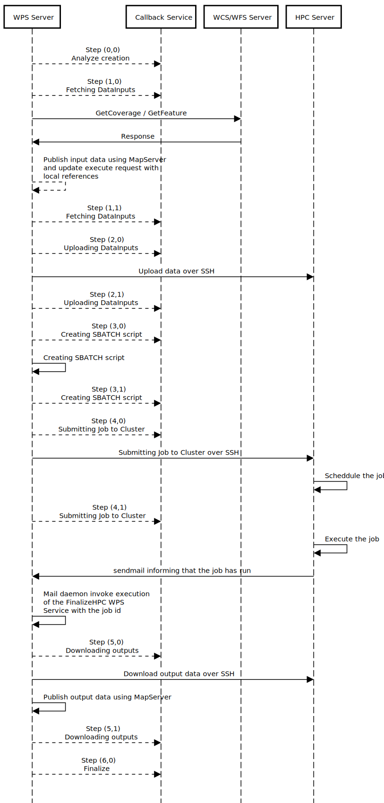

.. _kernel-hpc:
    
Optional HPC support
======================

The optional ZOO-Kernel HPC support gives you the opportunity to use
OGC WPS for invoking remote execution of OTB applications. The current
implementation rely on `OpenSSH <https://www.openssh.com/>`_ and the
`Slurm <http://slurm.schedmd.com/>`_  scheduler. 

.. note:: 

   |slurm| `Slurm <http://slurm.schedmd.com/>`_ is an acronym for Simple Linux Utility for Resource Management. Learn more on official `website <https://slurm.schedmd.com/overview.html>`__.

For executing an OGC WPS Service using this HPC support, one should
use the OGC WPS version 2.0.0 and asynchornous request. Any tentative
to execute synchronously a HPC service will fail with the message "The
synchronous mode is not supported by this type of service". The
ZOO-Kernel is not the only responsible for the execution and will wait
for the execution on the HPC server to end before being able to
continue its execution. Also, transfering the data from the WPS server
to the cluster and downloading the data produced by the execution will
take time. Hence, when OGC WPS Client will request for GetCapabilities
or DescribeProcess only the "async-execute" mode will be present in
the jobControlOptions attribute for the HPC services.

You can see in the sequence diagram below the interactions between
the OGC WPS Server (ZOO-Kernel), the mail daemon (running on the OGC
WPS server), the Callback Service and, the HPC Server during an
execution of a HPC Service. The dashed lines represent the behavior in
case the optional callback service invocation has been activated. These 
invocations are made asynchronously for lowering their impact over the
whole process in case of failure of the callback service for instance.

By now, the callback service is not a WPS service but an independent server.

|hpc_support|

.. |slurm| image:: https://slurm.schedmd.com/slurm_logo.png
       :height: 100px
       :width: 100px
       :scale: 45%
       :alt: Slurm logo

Installation and configuration
------------------------------

Follow the step described below in order to activate the ZOO-Project optional HPC support.

Prerequisites
.....................

   * latest `ZOO-Kernel
     <http://zoo-project.org/trac/browser/trunk/zoo-project/zoo-kernel>`_
     trunk version
   * `libssh2 <https://www.libssh2.org/>`_
   * `MapServer <http://www.mapserver.org>`_
   * an access to a server with `Slurm  <http://slurm.schedmd.com>`_
     and `OrfeoToolBox <https://www.orfeo-toolbox.org>`_.

Installation steps
...........................

ZOO-Kernel
****************************

Compile ZOO-Kernel using the configuration options as shown below:

.. code-block:: guess

     cd zoo-kernel
     autoconf
     ./configure  --with-hpc=yes --with-ssh2=/usr --with-mapserver=/usr --with-ms-version=7
     make
     sudo make install

Optionally, you can ask your ZOO-Kernel to invoke a callback service
which is responsible to record execution history and data
produced. In such a case you can add the ``--with-callback=yes``
option to the configure command. 

.. note::

   In case you need other languages to be activated, such as Python
   for exemple, please use the corresponding option(s).

FinalizeHPC WPS Service
****************************

For being informed that the remote OTB application ends on the
cluster, one should invoke the FinalizeHPC service. It is responsible
to connect using SSH to the HPC server to run an ``sacct`` command for
extracting detailled informations about the sbatch that has been
run. If the ``sacct`` command succeed, and the service is no more
running on the cluster, then the informations are stored in a local
conf file containing a ``[henv]`` section definition, the service
connect to unix domain socket (opened by the ZOO-Kernel that has
initially schedduled the service through Slurm) to inform about the
end of the service run on the cluster. This makes the initial
ZOO-Kernel to continue its execution by downloading output data
produced over the execution of the OTB application on the cluster. So,
this service should be build and deployed on your WPS server. You can
use the following commands to do so. 

.. code-block:: guess

     cd zoo-service/utils/hpc
     make
     cp cgi-env/* /usr/lib/cgi-bin
     mkdir -p /var/data/xslt/
     cp xslt/updateExecute.xsl /var/data/xslt/
     
You should also copy the 
.. note::

   FinalizeHPC should be called from a daemon, responsible for reading
   mails sent by the cluster to the WPS server.

Configuration steps
...............................

Main configuration file
****************************

When HPC support is activated, you can use different HPC configuration
by adding ``confId`` to your usual ``serviceType=HPC`` in your zcfg
file. For being able to find which configuration a service should
use, the ZOO-Kernel require to know what are the options for creating
the relevant sbatch.

Also, you can define multiple configuration to run the OTB application
on the cluster(s) depending on the size of the inputs. You should
define in the section corresponding to your ``ServiceType`` the
treshold for both raster (``preview_max_pixels``) and vector
(``preview_max_features``) input. In case the raster or the vector
dataset is upper the defined limit, then the ``fullres_conf`` will
be used, in other case the ``preview_conf`` will be.

For each of this configurations, you will have define the parameters
to connect the HPC server, by providing ``ssh_host``, ``ssh_port``,
``ssh_user`` and, ``ssh_key``. Also, you should set where the input
data will be stored on the HPC server, by defining
``remote_data_path`` (the default directory to store data),
``remote_presistent_data_path`` (the directory to store data
considerated as shared data, see below)  and, ``remote_work_path`` the
directory used to store the SBATCH script created locally then,
uploaded by the ZOO-Kernel.

Also, there are multiple options you can use to run your applications
using  SBATCH. You can define them using ``jobscript_header``,
``jobscript_body`` and ``jobscript_footer`` or by using
``sbatch_options_<SBATCH_OPTION>`` where ``<SBATCH_OPTION>`` should be
replaced by a real option name, like ``workdir`` in the following
example. For creating the SBATCH file, the ZOO-Kernel create a file
starting with the content of the file pointed by ``jobscript_header``
(if any, a default header is set in other case), then, any option
defined in ``sbatch_options_*`` and a specific one: ``job-name``,
then, ``jobscript_body`` is added (if any, usually to load required
modules), then the ZOO-Kernel add the invocation of the OTB
application then, optionally the ``jobscript_footer`` is added, if
any.

Finally, ``remote_command_opt`` should contains all the informations
you want to be extracted by the ``sacct`` command run by the
FinalizeHPC service. ``billing_nb_cpu`` is used for billing purpose to
define a cost for using a specific option (preview or fullres).

In addition to the specific ``HPC_<ID>`` section and the corresponding
fullres and preview ones, you should define in the ``[security]``
section using the ``shared`` parameter to set the URLs from where the
downloaded data should be considerated as shared, meaning that even if
this ressources requires authentication to be accessed, any
authenticated user will be allowed to access the cache file even if
it was created by somebody else. Also, this shared cache won't contain
any authentication informations in the cache file name as it is
usually the case.

.. code-block:: guess

     [HPC_Sample]
     preview_max_pixels=820800
     preview_max_features=100000
     preview_conf=hpc-config-2
     fullres_conf=hpc-config-1
     
     [hpc-config-1]
     ssh_host=mycluster.org
     ssh_port=22
     ssh_user=cUser
     ssh_key=/var/www/.ssh/id_rsa.pub
     remote_data_path=/home/cUser/wps_executions/data
     remote_persitent_data_path=/home/cUser/wps_executions/datap
     remote_work_path=/home/cUser/wps_executions/script
     jobscript_header=/usr/lib/cgi-bin/config-hpc1_header.txt
     jobscript_body=/usr/lib/cgi-bin/config-hpc1_body.txt
     sbatch_options_workdir=/home/cUser/wps_executions/script
     sbatch_substr=Submitted batch job 
     billing_nb_cpu=1
     remote_command_opt=AllocCPUS,AllocGRES,AllocNodes,AllocTRES,Account,AssocID,AveCPU,AveCPUFreq,AveDiskRead,AveDiskWrite,AvePages,AveRSS,AveVMSize,BlockID,Cluster,Comment,ConsumedEnergy,ConsumedEnergyRaw,CPUTime,CPUTimeRAW,DerivedExitCode,Elapsed,Eligible,End,ExitCode,GID,Group,JobID,JobIDRaw,JobName,Layout,MaxDiskRead,MaxDiskReadNode,MaxDiskReadTask,MaxDiskWrite,MaxDiskWriteNode,MaxDiskWriteTask,MaxPages,MaxPagesNode,MaxPagesTask,MaxRSS,MaxRSSNode,MaxRSSTask,MaxVMSize,MaxVMSizeNode,MaxVMSizeTask,MinCPU,MinCPUNode,MinCPUTask,NCPUS,NNodes,NodeList,NTasks,Priority,Partition,QOS,QOSRAW,ReqCPUFreq,ReqCPUFreqMin,ReqCPUFreqMax,ReqCPUFreqGov,ReqCPUS,ReqGRES,ReqMem,ReqNodes,ReqTRES,Reservation,ReservationId,Reserved,ResvCPU,ResvCPURAW,Start,State,Submit,Suspended,SystemCPU,Timelimit,TotalCPU,UID,User,UserCPU,WCKey,WCKeyID
     
     [hpc-config-2]
     ssh_host=mycluster.org
     ssh_port=22
     ssh_user=cUser
     ssh_key=/var/www/.ssh/id_rsa.pub
     remote_data_path=/home/cUser/wps_executions/data
     remote_persitent_data_path=/home/cUser/wps_executions/datap
     remote_work_path=/home/cUser/wps_executions/script
     jobscript_header=/usr/lib/cgi-bin/config-hpc2_header.txt
     jobscript_body=/usr/lib/cgi-bin/config-hpc2_body.txt
     sbatch_options_workdir=/home/cUser/wps_executions/script
     sbatch_substr=Submitted batch job 
     billing_nb_cpu=4
     remote_command_opt=AllocCPUS,AllocGRES,AllocNodes,AllocTRES,Account,AssocID,AveCPU,AveCPUFreq,AveDiskRead,AveDiskWrite,AvePages,AveRSS,AveVMSize,BlockID,Cluster,Comment,ConsumedEnergy,ConsumedEnergyRaw,CPUTime,CPUTimeRAW,DerivedExitCode,Elapsed,Eligible,End,ExitCode,GID,Group,JobID,JobIDRaw,JobName,Layout,MaxDiskRead,MaxDiskReadNode,MaxDiskReadTask,MaxDiskWrite,MaxDiskWriteNode,MaxDiskWriteTask,MaxPages,MaxPagesNode,MaxPagesTask,MaxRSS,MaxRSSNode,MaxRSSTask,MaxVMSize,MaxVMSizeNode,MaxVMSizeTask,MinCPU,MinCPUNode,MinCPUTask,NCPUS,NNodes,NodeList,NTasks,Priority,Partition,QOS,QOSRAW,ReqCPUFreq,ReqCPUFreqMin,ReqCPUFreqMax,ReqCPUFreqGov,ReqCPUS,ReqGRES,ReqMem,ReqNodes,ReqTRES,Reservation,ReservationId,Reserved,ResvCPU,ResvCPURAW,Start,State,Submit,Suspended,SystemCPU,Timelimit,TotalCPU,UID,User,UserCPU,WCKey,WCKeyID
     
     [security]
     attributes=Cookie,Cookies
     hosts=*
     shared=myhost.net/WCS

You can see below an example of ``jobscript_header`` file.

.. code-block:: guess

     #!/bin/sh
     #SBATCH --ntasks=1
     #SBATCH --ntasks-per-node=1
     #SBATCH --exclusive
     #SBATCH --distribution=block:block
     #SBATCH --partition=partName
     #SBATCH --mail-type=END              # Mail events (NONE, BEGIN, END, FAIL, ALL)
     #SBATCH --mail-user=user@wps_server.net   # Where to send mail

You can see below an example of ``jobscript_body`` file.

.. code-block:: guess

     # Load all the modules
     module load cv-standard
     module load cmake/3.6.0
     module load gcc/4.9.3
     module load use.own
     module load OTB/6.1-serial-24threads

In casse you have activated the callback service, then you should also
have a ``[callback]`` section, in which you will define ``url`` to
invoke the callback service, ``prohibited`` to list the services that
should not require invocation of the callback sercvice if any and,
``template`` pointing to the local ``updateExecute.xsl`` file used to
replace any inputs provided by value to the reference to the locally
published OGC WFS/WCS web services. This execute request is provided
to the callback service.

.. code-block:: guess

     [callback]
     url=http://myhost.net:port/callbackUpdate/
     prohibited=FinalizeHPC,Xml2Pdf,DeleteData
     template=/home/cUser/wps_dir/updateExecute.xsl

OGC WPS Services metadata
****************************

To produce the zcfg files corresponding to the metadata definition of
the WPS services, you can use the otb2zcfg tool to produce them. You
will need to replace ``serviceType=OTB`` by ``serviceType=HPC`` and,
optionally, add one line containing ``confId=HPC_Sample`` for
instance.

Please refer to `otb2zcfg
<./orfeotoolbox.html#services-configuration-file>`_ documentation to
know how to use this tool.

Using the HPC support, when you define one output, there will be
automatically 1 to 3 inner outputs created for the defined output:

download_link
   URL to download to generated output 

wms_link
   URL to access the OGC WMS for this output (only in case
   `useMapserver=true`)

wcs_link/wfs_link
   URL to access the OGC WCS or WFS for this output (only in case
   `useMapserver=true`) 

You can see below an example of Output node resulting of the
definition of one output named out and typed as geographic imagery.

.. code-block:: guess

      <wps:Output>
        <ows:Title>Outputed Image</ows:Title>
        <ows:Abstract>Image produced by the application</ows:Abstract>
        <ows:Identifier>out</ows:Identifier>
        <wps:Output>
          <ows:Title>Download link</ows:Title>
          <ows:Abstract>The download link</ows:Abstract>
          <ows:Identifier>download_link</ows:Identifier>
          <wps:ComplexData>
            <wps:Format default="true" mimeType="image/tiff"/>
            <wps:Format mimeType="image/tiff"/>
          </wps:ComplexData>
        </wps:Output>
        <wps:Output>
          <ows:Title>WMS link</ows:Title>
          <ows:Abstract>The WMS link</ows:Abstract>
          <ows:Identifier>wms_link</ows:Identifier>
          <wps:ComplexData>
            <wps:Format default="true" mimeType="image/tiff"/>
            <wps:Format mimeType="image/tiff"/>
          </wps:ComplexData>
        </wps:Output>
        <wps:Output>
          <ows:Title>WCS link</ows:Title>
          <ows:Abstract>The WCS link</ows:Abstract>
          <ows:Identifier>wcs_link</ows:Identifier>
          <wps:ComplexData>
            <wps:Format default="true" mimeType="image/tiff"/>
            <wps:Format mimeType="image/tiff"/>
          </wps:ComplexData>
        </wps:Output>
      </wps:Output>

   

