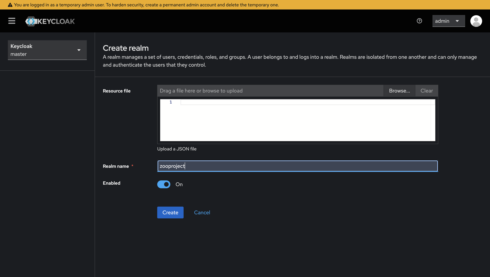
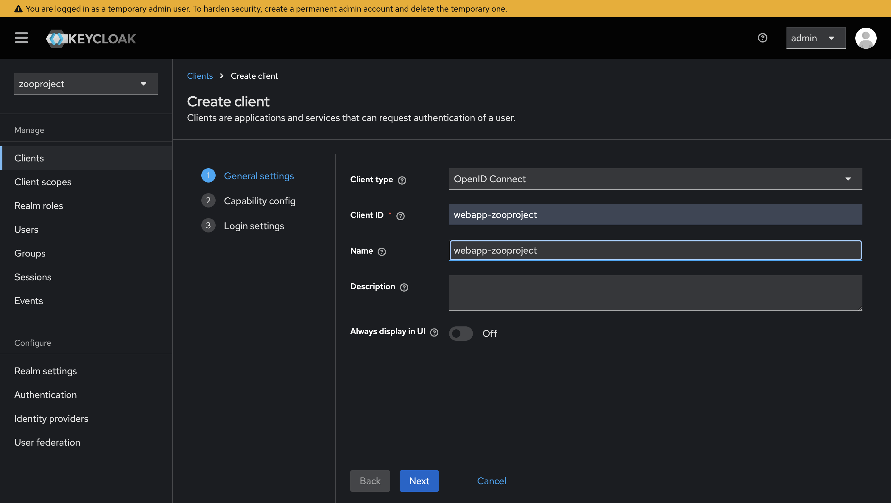
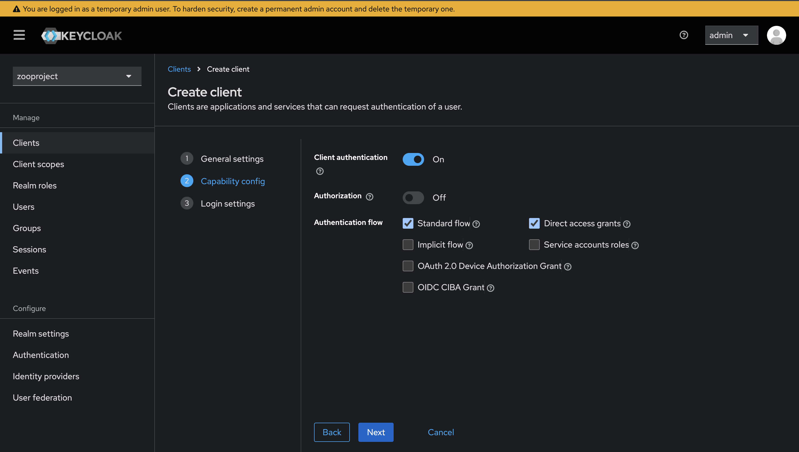
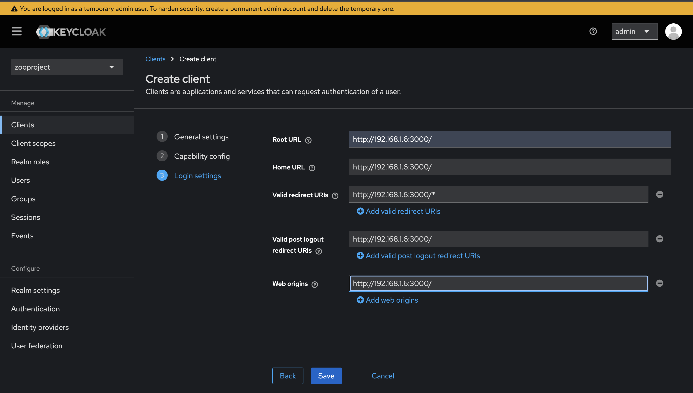
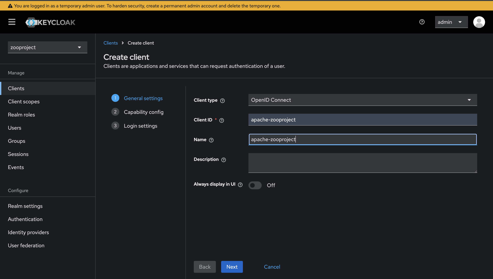
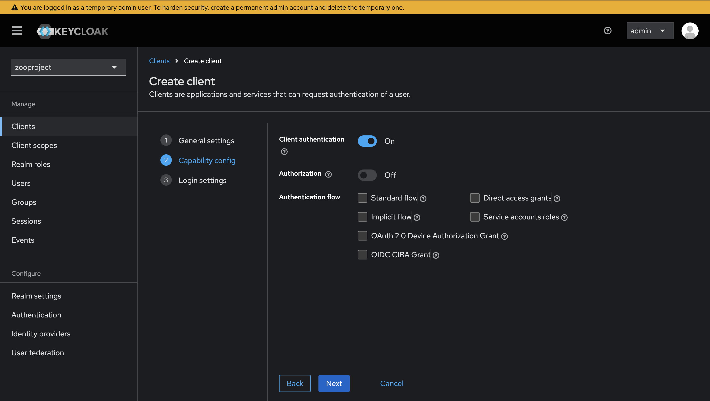
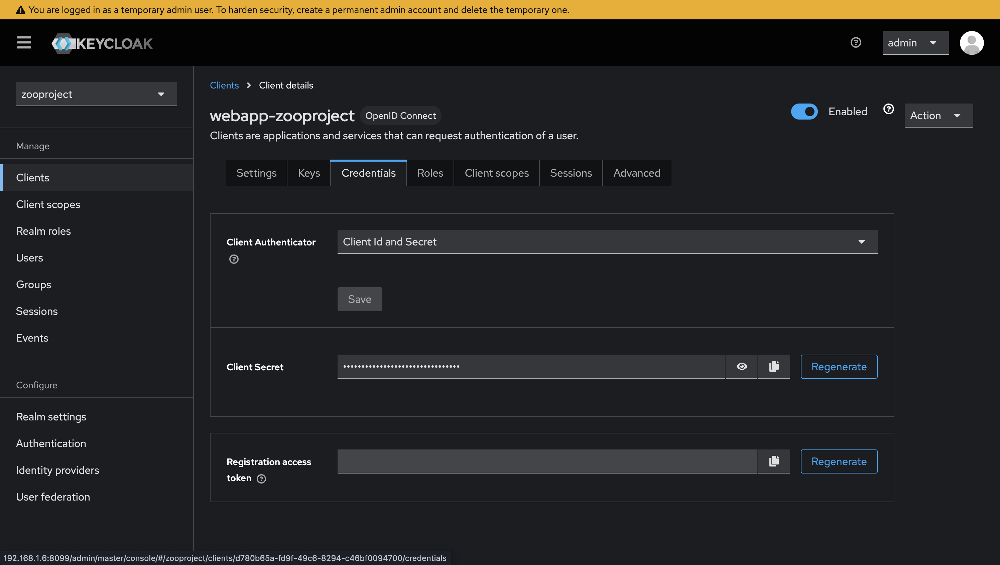
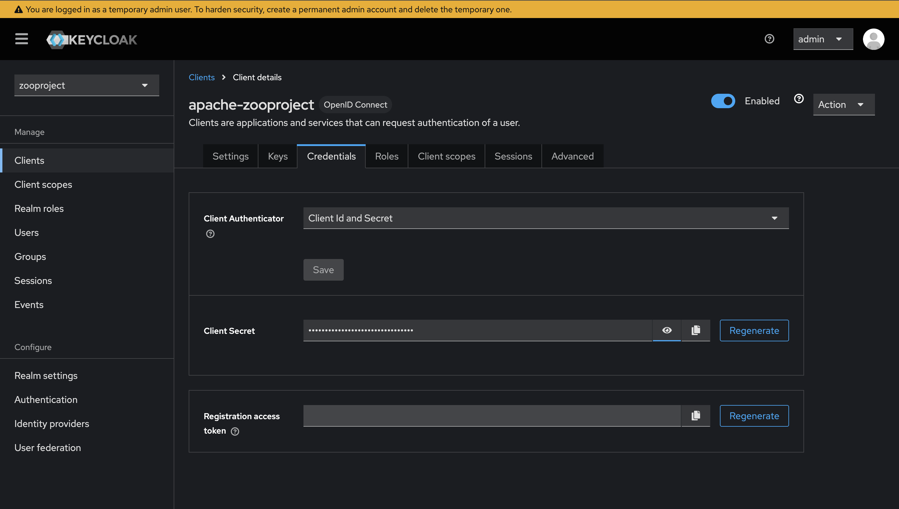
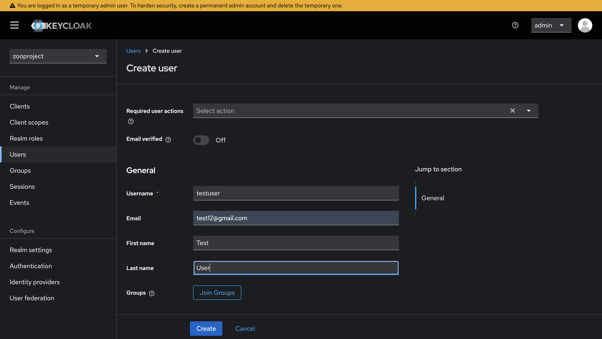
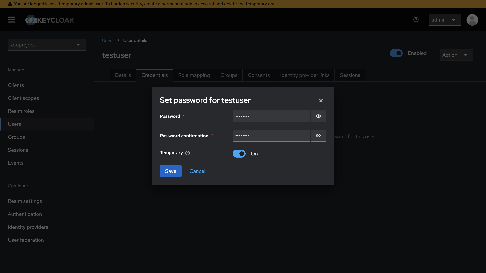

Keycloak Integration with ZOO-Project
=====================================

This guide documents the integration of Keycloak into the ZOO-Project using a remote or Docker-hosted Keycloak instance. The goal is to secure OGC API endpoints using HTTP Bearer Token authentication.

Overview
--------

ZOO-Project's endpoints like `/ogc-api/jobs`, `/ogc-api/processes`, `/ogc-api/stac`, and `/ogc-api/raster` can be protected using Keycloak-based authentication via the `libapache2-mod-auth-openidc` Apache module.

Two Keycloak clients are required:

1. **API Client** (for Apache to validate Bearer tokens)
2. **Web Client** (for the Nuxt web app to authenticate users and obtain tokens)

Docker Setup
------------

### docker-compose-ko.yml (Keycloak service)

This file is located at: `zoo-project/docker/nuxt-client/`

.. code-block:: yaml

    services:
      keycloak:
        image: quay.io/keycloak/keycloak:26.0.7
        command:
          - start-dev
          - --http-enabled=true
          - --verbose
        environment:
          KEYCLOAK_ADMIN: admin
          KEYCLOAK_ADMIN_PASSWORD: admin
        ports:
          - "8099:8080"
        networks:
          front-tier:
            ipv4_address: 172.37.0.18

    networks:
      front-tier:
        ipam:
          driver: default
          config:
            - subnet: "172.37.0.0/24"

To run the above service:

.. code-block:: bash

    docker compose -f docker/nuxt-client/docker-compose-ko.yml up -d --build

**Note**: If port 8099 is already in use, run the following to find and stop the conflicting process:

.. code-block:: bash

    sudo lsof -i :8099
    docker stop <container_id>

Nuxt Client Setup
-----------------

### docker-compose.yml (Nuxt client service)

Please verify that the nuxclient service is correctly configured in the docker-compose.yml file.

File path: `zoo-project/docker-compose.yml`

.. code-block:: yaml

    nuxtclient:
      platform: linux/amd64
      image: zooproject/nuxt-client-test:latest
      build:
        context: .
        dockerfile: docker/nuxt-client/Dockerfile
      networks:
        front-tier-1:
          ipv4_address: 172.15.232.17
      ports:
        - "0.0.0.0:3000:3000"
      env_file:
        - ./docker/nuxt-client/env_nuxt.sample

Keycloak Setup
--------------

1. Open Keycloak in your browser: http://192.168.1.6:8099/

Log in to Keycloak using the default admin credentials:
  - Username: `admin`
  - Password: `admin`

After logging in, follow the steps below to configure Keycloak for the ZOO-Project.

2. In the left sidebar:
   - Click the **Keycloak master** dropdown.
   - Create a new realm named: **zooproject**

3. Under the **Clients** section:
   - Click **Create Client**
   - Create two clients:
     - `webapp-zooproject`
     - `apache-zooproject`

All the URLs in this webapp-zooproject creation should be your local IP address, and make sure to keep the validate redirect URLs input as /*

- For each client:
- After creation, go to the **Credentials** tab.
- Copy and store the **Client Secret** for each client.

4. To create a test user:
   - Go to **Users** → **Add user**

- After saving, go to the **Credentials** tab
- Set a password (e.g., `test123`) and save

Nuxt Environment Configuration
------------------------------

1. Open the file `docker/nuxt-client/env_nuxt.sample`

2. Ensure that your local IP address is correctly specified in the environment variable configuration within this file.

::

    NUXT_OIDC_ISSUER=http://your-ip-address:8099/realms/zooproject
    NUXT_OIDC_CLIENT_ID=webapp-zooproject
    NUXT_OIDC_CLIENT_SECRET=<webapp-zooproject client secret>
    NUXT_ZOO_BASEURL=http://your-ip-address
    NUXT_BASE_URL=http://your-ip-address:3000
    AUTH_ORIGIN=http://your-ip-address:3000
    NEXTAUTH_URL=http://your-ip-address:3000

Apache OIDC Configuration
-------------------------

1. Open `docker/nuxt-client/default.conf`

2. Update the following block with details from the `apache-zooproject` client:

::

    OIDCProviderMetadataURL http://your-ip-address:8099/realms/zooproject/.well-known/openid-configuration
    OIDCRedirectURI /
    OIDCClientID apache-zooproject
    OIDCClientSecret <apache-zooproject client secret>
    OIDCCryptoPassphrase <apache-zooproject client secret>
    OIDCRemoteUserClaim email
    OIDCScope "openid email"
    OIDCProviderTokenEndpointAuth client_secret_basic
    OIDCOAuthVerifyJwksUri http://your-ip-address:8099/realms/zooproject/protocol/openid-connect/certs

Configuration Files
-------------------

**main.cfg** (required headers)

.. code-block:: ini

  [headers]
  Access-Control-Allow-Origin=*
  Access-Control-Allow-Methods=GET, POST, PUT, PATCH, OPTIONS, DELETE, HEAD
  Access-Control-Allow-Headers=Content-Type, Accept, Authorization, Origin, Prefer

**oas.cfg** (check rootHost/rootUrl)

- Make sure they point to the IP.

Build and Launch Nuxt Client
----------------------------

To build and run the Nuxt client:

::

    docker compose -f docker-compose.yml --project-directory . build nuxtclient --no-cache
    docker compose -f docker-compose.yml --project-directory . up -d

Once completed, open the Nuxt client and Login at:

http://your-ip-address:3000/

