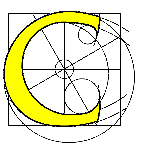
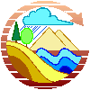

.. _services-available:

Available ZOO-Services
======================

`ZOO-Project <http://zoo-project.org>`__ includes some ready-to-use WPS Services based on reliable open source libraries such as such as `GDAL <http://gdal.org>`_, `CGAL <http://gcal.org>`_, `GRASS GIS <http://grass.osgeo.org>`_, `OrfeoToolbox <http://orfeo-toolbox.org>`__ and `SAGA GIS <https://www.orfeo-toolbox.org>`__.

:ref:`services_index` are either developed in C/Python (with minor modifications with respect to the orginal software source code) and stored in the  ``zoo-services`` `svn <http://zoo-project.org/trac/browser/trunk/zoo-project/zoo-services>`__ directory or automatically generated using some of :ref:`kernel_index` configuration options. 

Based on GDAL 
-------------

.. note:: 

  |gdal| `GDAL <http://gdal.org>`__ is the Geospatial Data Abstraction
  Library. Learn more on official `website <http://gdal.org>`__.
 

..   csv-table:: 

    Name,Description,Language
    `Gdal_Contour <http://zoo-project.org/trac/browser/trunk/zoo-project/zoo-services/gdal/contour>`__,Builds vector contour lines from a raster elevation model,C
    `Gdal_Grid <http://zoo-project.org/trac/browser/trunk/zoo-project/zoo-services/gdal/grid>`__,Creates regular raster grid from the scattered data read from an OGR datasource,C
    `Gdal_Dem <http://zoo-project.org/trac/browser/trunk/zoo-project/zoo-services/gdal/dem>`__,Provides tools to analyze raster elevation model,C
    `Gdal_Ndvi <http://zoo-project.org/trac/browser/trunk/zoo-project/zoo-services/gdal/ndvi>`__,Computes Normalized Difference Vegetation Index on a raster file,Python
    `Gdal_Profile <http://zoo-project.org/trac/browser/trunk/zoo-project/zoo-services/gdal/profile>`__,Fetches XYZ values of a raster DEM along a linestring,C
    `Gdal_Translate <http://zoo-project.org/trac/browser/trunk/zoo-project/zoo-services/gdal/translate>`__,Converts raster data between different formats,C
    `Gdal_Warp <http://zoo-project.org/trac/browser/trunk/zoo-project/zoo-services/gdal/translate>`__,Mosaic/Reproject/Warp a raster image,C
    `Ogr2Ogr <http://zoo-project.org/trac/browser/trunk/zoo-project/zoo-services/ogr/ogr2ogr/>`__,Converts vector data from one format to another,C
    `Base-vect-ops <http://zoo-project.org/trac/browser/trunk/zoo-project/zoo-services/ogr/base-vect-ops>`__,Provides tools for single and multiple geometries vector-based spatial analysis ,C
    `Base-vect-ops <http://zoo-project.org/trac/browser/trunk/zoo-project/zoo-services/ogr/base-vect-ops-py>`__,Provides tools for single and multiple geometries vector-based spatial analysis ,Python
    
Based on CGAL
-------------

.. note:: 

  |cgal| `CGAL <http://gdal.org>`__ is the Computational Geometry Algorithms Library. Learn more on official `website <http://cgal.org>`__.
 

..   csv-table:: 

    Name,Description,Language
    `Cgal_Delaunay <http://zoo-project.org/trac/browser/trunk/zoo-project/zoo-services/cgal/delaunay.c>`__,Computes the edges of Delaunay triangulation for a set of data points,C
    `Ggal_Voronoi <http://zoo-project.org/trac/browser/trunk/zoo-project/zoo-services/cgal/voronoi.c>`__,Computes the edges of Voronoi diagram for a set of data points,C
    
Based on GRASS GIS 
------------------

.. note:: 

  |grass| `GRASS GIS <http://grass.osgeo.org>`__ is the Geographic Resources Analysis Support System. Learn more on official `website <http://grass.osgeo.org>`__.
 

	    
..   csv-table:: 

    Name,Description,Language
   `Raster modules (r.*) <http://grass.osgeo.org/grass70/manuals/raster.html>`__,Most of the GRASS7 vector modules are supported,C
   `Vector modules (v.*) <http://grass.osgeo.org/grass70/manuals/vector.html>`__,Most of the GRASS7 vector modules are supported,C
   `Imagery modules (i.*) <http://grass.osgeo.org/grass70/manuals/imagery.html>`__,Most of the GRASS7 iamgery modules are supported,C

`GRASS GIS 7 <http://grass.osgeo.org>`__ modules can be used as :ref:`services_index` without any modification using the `wps-grass-bridge <https://code.google.com/p/wps-grass-bridge/>`__ library. The latter includes useful tools such as `GrassXMLtoZCFG.py <https://code.google.com/p/wps-grass-bridge/source/browse/trunk/GrassXMLtoZCFG.py>`__ and `ZOOGrassModuleStarter.py <https://code.google.com/p/wps-grass-bridge/source/browse/trunk/ZOOGrassModuleStarter.py>`__ for using the supported GRASS modules directly as ZOO-Services. A step-by-step installation guide suited for ZOO-Project is available in the `wps-grass-bridge <https://code.google.com/p/wps-grass-bridge/wiki/ZOO_WPS_Integration>`__ documentation.  

    
Based on Orfeo Toolbox 
----------------------

.. note:: 

   |otb| `Orfeo Toolbox <https://www.orfeo-toolbox.org>`__ is an open
   source image processing library. Learn more on official `website <https://www.orfeo-toolbox.org>`__.
 

.. |otb| image:: ../_static/orfeotoolbox.png
       :height: 115px
       :width: 150px
       :scale: 40%
       :alt: Orfeo Toolbox logo

`Orfeo Toolbox <https://www.orfeo-toolbox.org>`__ `Applications <http://otbcb.readthedocs.org/en/latest/Applications.html>`__ can be used as :ref:`services_index` without any modification
using the :ref:`kernel-orfeotoolbox`.

Based on SAGA GIS
-----------------

.. note:: 

   |saga| `SAGA GIS <https://www.orfeo-toolbox.org>`__ is the System for Automated Geoscientific Analyses. Learn more on official `website <http://www.saga-gis.org/en/index.html>`__.
 

