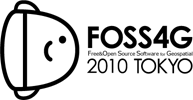

.. _workshop-foss4g-japan-2010:

ZOO-Project Workshop 2010
======================================================

:Original Title: **Practical Introduction to ZOO: The Open WPS Platform**
:Author:  Nicolas Bozon, Gérald Fenoy, Venkatesh Raghavan
:Last Updated: $Date$
:Events: FOSS4G 2010 Osaka / Tokyo / Beijing

.. image:: ./images/molamola_gps1.png
   :width: 100px
   :height: 100px

**Workshop Table of Contents**

.. toctree::
   :maxdepth: 5
   
   introduction
   using_zoo_from_osgeolivevm
   ogr_base_vect_ops
   building_wps_client_using_ol
   exercise
