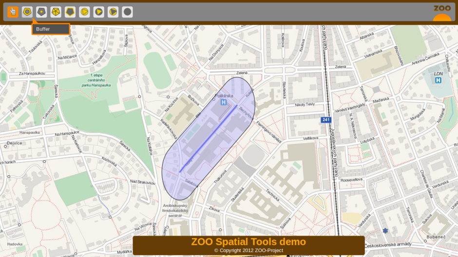
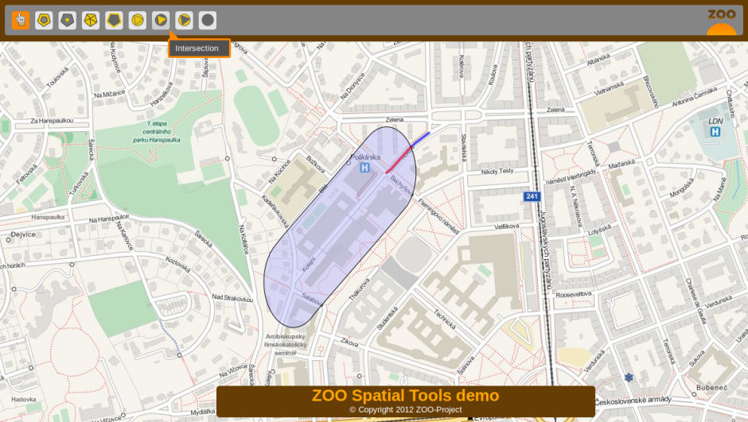

.. _ogr_base_vect_ops:

*********************************************************
Presenting building blocks - Using OGR based Web Services 
*********************************************************

.. contents:: Table of Contents
    :depth: 5
    :backlinks: top

Introduction
============

In this section, you will use basic ZOO-Services : ``BufferPy``, 
``IntersectionPy`` and ``DifferencePy`` which use OGR Python module.
The intended goal of this section is to present and interact with your new building blocks before chaining them in the next section.

First of all, you should use the following link to access a user interface to interact with your service :
`http://localhost/zoows-demo/spatialtools-py.html <http://localhost/zoows-demo/spatialtools-py.html>`__

Services Provider and configuration files
=========================================

First you may verify if the ZOO-Services are available from your current setup.
You can take a look at the ``Buffer.zcfg``, ``Intersection.zcfg`` and 
``DifferencePy.zcfg`` to get details about parameters.
As you can see from the ZCFG files, you will use ZOO-Services provided by the 
``foss4g_ws`` Python service provider. So if you want to modify the Python code
you will have to edit this file. 
You are invited to use similar requests as you seen in previous sections to learn about each service.

The Buffer Service
=========================

First click on a street then once the street is displayed in blue, click the 
'Buffer' button on top, you should get similar result as displayed in the following.

Since version ZOO-Project 1.2.0, you can run automatically some basic tests to 
make sure that you wrote a correct ZCFG file and your service is validating.

.. note:: the current testing is really simple and should be adapted to each Services 
    Provider, mainly to define input names.

You can use the following command:

.. code-block:: bash
    
    cd /home/user/zoo/testing
    ./run.sh http://localhost/cgi-bin/zoo_loader.cgi Buffer

.. note:: During or after the test run, you can take a look inside the ``tmp`` directory 
    which contains both the XML requests send to the ZOO Kernel (``*1.xml``) and the 
    responses it gave (``output*.xml``).

The Intersection Service
=========================

Using the same client interface as before, once you get a Buffer, you can then 
select a street intersecting the Buffer geometry to compute intersection by clicking on the Intersection button.

    

The Difference Service
=========================

Using the same instructions as for Intersetion, you can get the following result.

.. image:: ./images/Difference_Level_15.png
   :width: 650px
   :align: center

Conclusion
========

Now you know this three services, and you get a simple interface to interact 
with your MapServer WFS and your ZOO-Project WPS Servers, you are ready to use 
the Services in a different way by chaining them using the ZOO-API to build 
more complexe and powerfull services.
