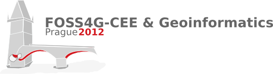

.. _workshop-foss4g-cee-2012:

##########################################
ZOO-Project Workshop 2012
##########################################

:Original Title: **Practical Introduction to ZOO-Project by playing with building blocks**
:Author:  Nicolas Bozon, Gérald Fenoy, Venkatesh Raghavan
:Contact: gerald.fenoy at geolabs.fr, nicolas.bozon at gmail.com
:Last Updated: $Date$
:Events: FOSS4G 2012 Prague

**WorkShop table of content**

.. toctree::
   :maxdepth: 5
   
   introduction
   using_zoo_from_osgeolivevm
   first_service
   building_blocks_presentation
   js_services_chaining
