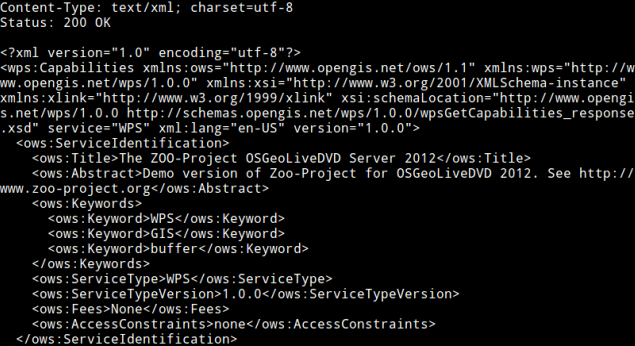

.. _using_zoo_from_osgeolivevm:

********************************************************************
Configuration and ZOO-Kernel use
********************************************************************

.. contents:: Table of Contents
    :depth: 5
    :backlinks: top

ZOO-Kernel Configuration
========================

As already said in introduction, an OSGeoLive virtual machine image disk has been installed on your computer, allowing you to use ZOO-Kernel in a development environment directly. Every ZOO-Project related material and source code have been placed in ``/home/user/zoo-ws-2012`` directory. We will work with file included in this directory during this workshop. 

.. note:: we will use ZOO-Kernel or ``zoo_loader.cgi`` script without any distinction 
    in this document.

As explained later, the ZOO-Kernel may require to store temporary files in ``/var/www/temp``. Depending on 
parameters set in the ``main.cfg``,  cache files would be located in the same directory.

.. code-block:: guess

    sudo mkdir /var/www/tmp
    sudo chown www-data /var/www/tmp

General ZOO-Kernel settings are made in the ``main.cfg`` file located in the same
directory as the ZOO-Kernel, so in ``/usr/lib/cgi-bin/``. You can see a typical 
``main.cfg`` content in the following:

.. code-block:: guess
    :linenos:
    
    [main]
    lang=en-US,fr-FR,ja-JP
    version=1.0.0
    encoding=utf-8
    serverAddress=http://localhost/zoo/
    dataPath=/var/www/data
    tmpPath=/var/www/tmp
    tmpUrl=../tmp
    cacheDir=/var/www/cache/
    mapserverAddress=http://localhost/cgi-bin/mapserv
    msOgcVersion=1.0.0
    
    [identification]
    title=The ZOO-Project FOSS4G 2012 Prague Workshop
    keywords=WPS,GIS,buffer
    abstract=ZOO-Project platform 2012 .See http://www.zoo-project.org for more informations
    accessConstraints=none
    fees=None
    
    [provider]
    positionName=Developer
    providerName=ZOO-Project
    addressAdministrativeArea=Lattes
    addressDeliveryPoint=1280 Av. des Platanes
    addressCountry=fr
    phoneVoice=False
    addressPostalCode=34970
    role=Dev
    providerSite=http://www.zoo-project.org
    phoneFacsimile=False
    addressElectronicMailAddress=gerald.fenoy@geolabs.fr
    addressCity=Lattes
    individualName=Gérald FENOY
 
The ``main.cfg`` file contains metadata informations about the identification and provider but also some important settings. The file is composed of various sections, namely ``[main]``, ``[identification]`` and ``[provider]`` per default. 

From the ``[main]`` section settings are as follow:
 * ``lang``: the supported languages separated by a coma (the first is the default one),
 * ``version``: the supported WPS version,
 * ``encoding``: the default encoding of WPS Responses,
 * ``serverAddress``: the url to access your ZOO-Kernel instance,
 * ``dataPath``: the path to store data files (when MapServer support was activated, 
   this directory is used to store mapfiles and data).
 * ``tmpPath``: the path to store temporary files (such as ExecuteResponse when 
   storeExecuteResponse was set to true),
 * ``tmpUrl``: a url relative to ``serverAddress`` to access the temporary file,
 * ``cacheDir``: the path to store cached request files [#f1]_ (optional),
 * ``mapservAddress``: your local MapServer address (optional),
 * ``msOgcVersion``: the version for all supported OGC Web Services output [#f2]_
   (optional).

The ``[identification]`` and ``[provider]`` section are specific to OGC metadata and
should be set [#f3]_.

Obviously, you are free to add new sections to this file if you need more. Nevertheless, you have to know 
that there is some specific names you should use only for specific needs: ``[env]``, ``[lenv]`` and
``[senv]``.

.. warning:: ``[senv]`` and ``[lenv]`` are used / produced on runtime internaly by the ZOO-Kernel and should be defined only from the Service code.

The ``env`` section is used to store specific environment variables you want to be set 
prior to load your Services Provider and run your Service. A typical example, is when your
Service requires to access to a X server running on framebuffer, then you will have to 
set the ``DISPLAY`` environnement variable, in this case you would add 
``DISPLAY=:1`` line in your ``[env]`` section.

The ``lenv`` is used to store runtime informations automatically set by the 
ZOO-Kernel before running your service and can be accesses / updated from it:
 * ``sid``: the service unique identifier, 
 * ``status``: the current progress value (value between 0 and 100, percent),
 * ``cwd``: the current working directory of the ZOO-Kernel,
 * ``message``: an error message when returning ``SERVICE_FAILED`` (optional),
 * ``cookie``: the cookie your service want to return to the client (for authentication
   purpose or tracking).

The ``senv`` is used to store session informations on the server side. You can then access them automatically from service if the server is requested using a valid cookie. The ZOO-Kernel will store on disk the values set in the ``senv`` maps, then load an dynamically added to the env stored in ``main.cfg``:
 * ``XXX``: the session unique identifier where ``XXX`` is the name included in the 
    returned cookie.

.. _cookie_example:

For instance, if you get the following in your Service source code [#f4]_ :

.. code-block:: python
    
    conf["lenv"]["cookie"]="XXX=XXX1000000; path=/" 
    conf["senv"]={"XXX": "XXX1000000","login": "demoUser"}

That means that the ZOO-Kernel will create a file ``sess_XXX1000000.cfg`` in the 
``cacheDir`` and return the specified cookie to the client. Each time the client will 
request the ZOO-Kernel using the Cookie, it will automatically load the value stored 
before running your service. You can then easilly access this informations from your 
service source code. This functionality won't be used in the following presentation.

Testing the ZOO installation with GetCapabilities
=================================================

You can request ZOO-Kernel using the following link from your Internet browser: 

http://localhost/cgi-bin/zoo_loader.cgi?Request=GetCapabilities&Service=WPS

You should get a valid Capabilities XML document, looking like the following :

.. image:: ./images/GC.png
   :width: 650px
   :align: center

Please note that some Process node are returned in the ProcessOfferings section, as somes are available already on OSGeoLive DVD. You can also run a GetCapabilities request from the command line, using the following command: 

.. code-block:: bash

    cd /usr/lib/cgi-bin
    ./zoo_loader.cgi “request=GetCapabilities&service=WPS”

The same result as in your browser will be returned, as shown in the following screenshot: 

Invoking ZOO Kernel from command line can be helpful during development process of new Services. 

.. rubric:: Footnotes

.. [#f1] when you use GET requests passed through ``xlink:href`` the ZOO-Kernel will
    execute the request only once, the first time you will ask for this ressource and it will
    store on disk the result. The next time you will need the same feature, the cached file
    will be used which make your process running faster. If ``cachedir`` was not 
    specified in the ``main.cfg`` then ``tmpPath`` value will be used.
.. [#f2] since version 1.3dev, when MapServer is activated, your service can automatically 
    return a WMS, WFS or WCS request to expose your data. Your can set here the specific
    version number you want to use to request your local MapServer setup. It depends 
    mostly on the client capability to deal with specific OGC Web Services version.
.. [#f3] since version 1.3dev, when MapServer is activated, the same metadata will be used
    for setting metadata for OGC Web Services.
.. [#f4] If you're not familiar with ZOO-Project, you can `pass <using_zoo_from_osgeolivevm#testing-the-zoo-installation-with-getcapabilities>`__  this part and come to it after the next section.
