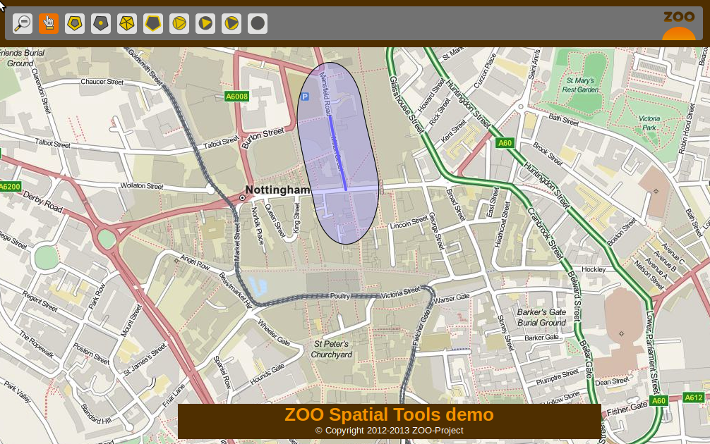
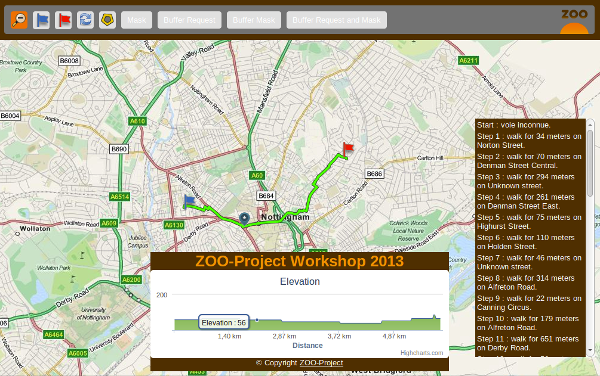

.. _ogr_base_vect_ops:

Building blocks presentation - Using OGR and PgRouting based Web Services 
===================================================

.. contents:: Table of Contents
    :depth: 5
    :backlinks: top

Introduction
------------------

In this section, you will use basic ZOO-Services : ``Buffer``, 
``Intersection`` and ``DifferencePy`` which use OGR and psycopg Python modules.
The intended goal of this section is to present and interact with your new building blocks before chaining them in the next section.

First of all, you should use the following links to access the user
interfaces and interact with your services, the first one is used to
access basic spatial-tools demo client interface and  the second to
access the routing application :
  * `http://localhost/zoows2013-demo/spatialtools-py.html <http://localhost/zoows2013-demo/spatialtools-py.html>`__
  * `http://localhost/zoo-ws2013/ <http://localhost/zoo-ws2013/>`__

Services Provider and configuration files
----------------------------------

First you may verify if the ZOO-Services are available from your current setup.
You can take a look at the ``Buffer.zcfg``, ``Intersection.zcfg`` and 
``DifferencePy.zcfg`` to get details about parameters.
As you can see from the ZCFG files, you will use ZOO-Services provided by the 
``service`` Python service provider. So if you want to modify the Python code
you will have to edit the corresponding file (so ``service.py``). 
You are invited to use similar requests as the one used in previous
sections to learn about each services individually.

The Buffer Service
------------------------------------

First click on a street then once the street is displayed in blue, click the 
'Buffer' button on top, you should get similar result as displayed in the following.

Since version ZOO-Project 1.2.0, you can run automatically some basic tests to 
make sure that you wrote a correct ZCFG file and your service is validating.

.. note:: the current testing is really simple and should be adapted to each Services 
    Provider, mainly to define input names.

You can use the following command:

.. code-block:: bash
    
    cd /home/user/zoo/testing
    ./run.sh http://localhost/cgi-bin/zoo_loader.cgi Buffer

.. note:: During or after the test run, you can take a look inside the ``tmp`` directory 
    which contains both the XML requests send to the ZOO Kernel (``*1.xml``) and the 
    responses it gave (``output*.xml``).

The Intersection Service
------------------------------------

Using the same client interface as before, once you get a Buffer, you can then 
select a street intersecting the Buffer geometry to compute intersection by clicking on the Intersection button.

    
.. image:: ./images/Intersection_Level_15.png
   :width: 650px
   :align: center

The DifferencePy Service
------------------------------------

Using the same instructions as for Intersetion, you can get the following result.

.. image:: ./images/Difference_Level_15.png
   :width: 650px
   :align: center

The Routing and Profile Services
------------------------------------

First click on the blue flag then place your starting point on the
map, do the same with the red flag to get the shortest path computed
by the dedicated service and then display its profile. Note that when
you pass the mouse over the profile display then you will see its
corresponding position displayed on the map. You can also click on a
specific step in your path to get the corresponding line displayed.

If you take a look in the file: ``/usr/lib/cgi-bin/routing/do.zcfg``
you may notice something new in the supported format which is
reproduced here after. 
 
.. code-block:: guess
    
    <Supported>
     mimeType = image/png
     asReference = true
     msStyle = STYLE COLOR 125 0 105 OUTLINECOLOR 0 0 0 WIDTH 3 END
     useMapServer = true
     extension = json
    </Supported>

The ``mimeType`` is defined as ``image/png`` and there is two new
parameter which are both optional:
  * ``useMapServer``: which make you able to inform the ZOO-Kernel
    that it have to use MapServer to publish your result as WMS / WFS or WCS (this last
    won't be used in this workshop) rather than simply storing the
    result as a file.
  * ``msStyle``: which let you define your own MapServer ``STYLE`` block definition.

When you need to access a result many time or for different purpose
accross other services then it is really useful to ask ZOO-Kernel to
publish your result as WMS, WFS or WCS.

Note that no modification of the code of the do service was required
to handle automatic pubilcation of the result as it is a vector format
supported by OGR, only modification of the zcfg was required.

This routing example is here to illustrate how easy it is to publish
your result as WMS, WFS or WCS ressource. Indeed, when your routing 
service was called, ZOO-Kernel published the result as WMS and WFS 
ressources which was both used first for the UI purpose, the WMS to 
display the resulting path on the map, the WFS for displaying details 
about each steps. The WFS protocol is also used as the input value 
for the profile computation. So, the computation was run once
and accessed three times for different purposes and from different 
clients.

For more informations about the MapServer support, please refer to `the
official  ZOO-Project Documentation <http://zoo-project.org/docs/kernel/mapserver.html>`_.

Conclusion
------------------------------------

Now you know this three services, and you get a simple interface to interact 
with your MapServer WFS and your ZOO-Project WPS Servers, you are ready to use 
the Services in a different way, by chaining them using the JavaScript ZOO-API to build 
more complexe and powerfull services.
