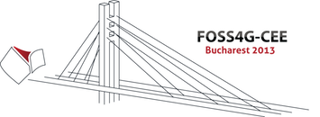

.. _workshop-foss4g-2013:

##########################################
ZOO-Project Workshop 2013
##########################################

:Original Title: **ZOO-Project: playing with building blocks to build pgRouting web application**
:Author:  Gérald Fenoy, Nicolas Bozon, Venkatesh Raghavan
:Contact: gerald.fenoy at geolabs.fr, nicolas.bozon at gmail.com, venka at osgeo.org
:Last Updated: $Date$
:Events: FOSS4G 2013 Nottingham, FOSS4G-CEE 2013 Bucharest

.. image:: ./images/foss4g2013-white-300.png
   :target: http://2013.foss4g.org/
   :align: center

**WorkShop table of content**

.. toctree::
   :maxdepth: 5
   
   introduction
   using_zoo_from_osgeolivevm
   first_service
   building_blocks_presentation
   js_services_chaining
