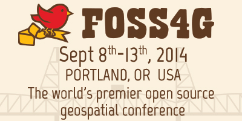

.. _workshop-foss4g-2014:

##########################################
ZOO-Project workshop 2014
##########################################

:Original Title: **Deploying Web Processing Services using ZOO-Project –
		 Examples of Python based WPS using PgRouting**
:Author:  Gérald Fenoy, Nicolas Bozon, Venkatesh Raghavan
:Contact: gerald.fenoy at geolabs.fr, nicolas.bozon at gmail.com, venka at osgeo.org
:Last Updated: $Date$
:Events: FOSS4G 2014 Portland

**WorkShop table of content**

.. toctree::
   :maxdepth: 5
   
   introduction
   using_zoo_from_osgeolivevm
   first_service
   building_blocks_presentation
   js_services_chaining
