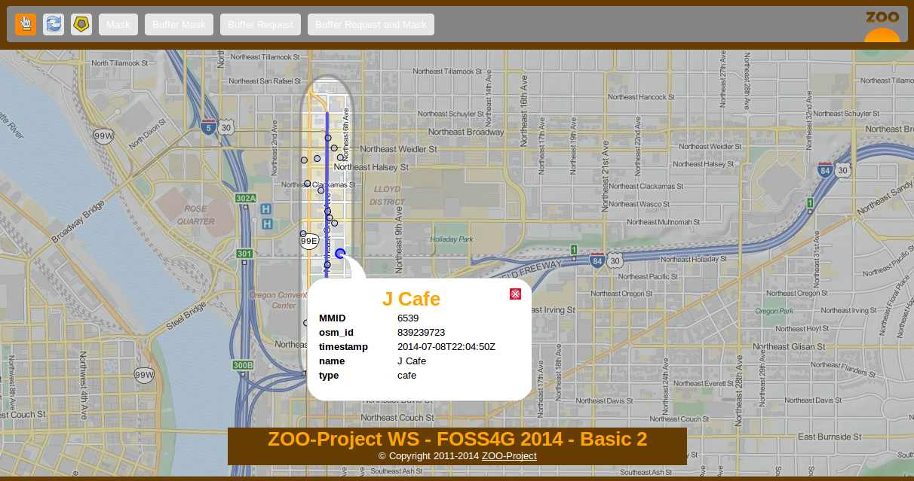
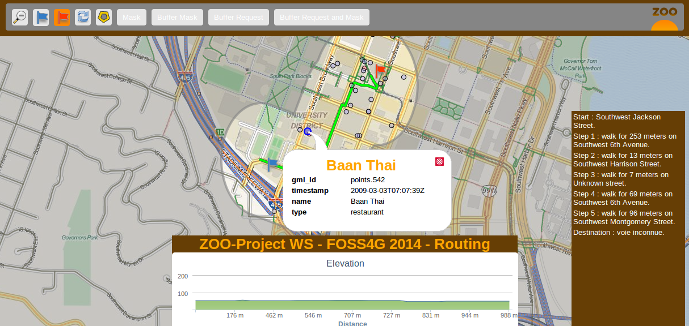
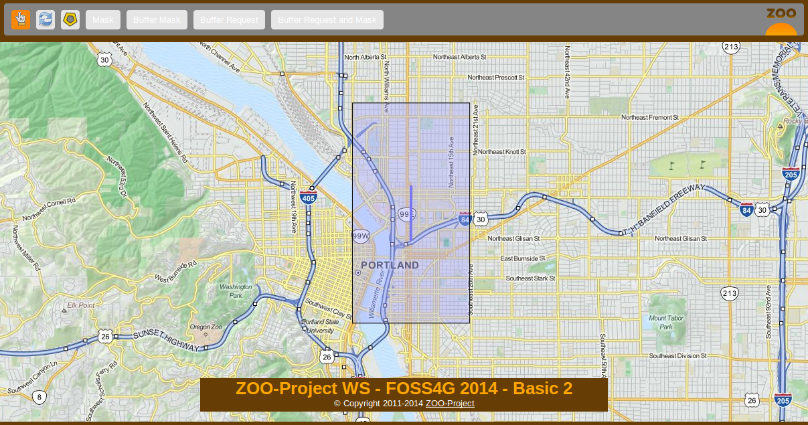
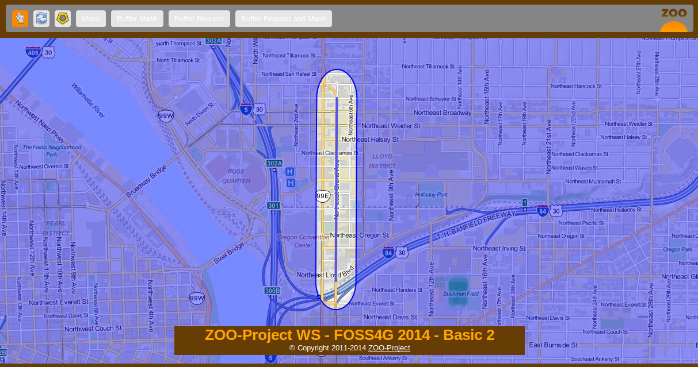
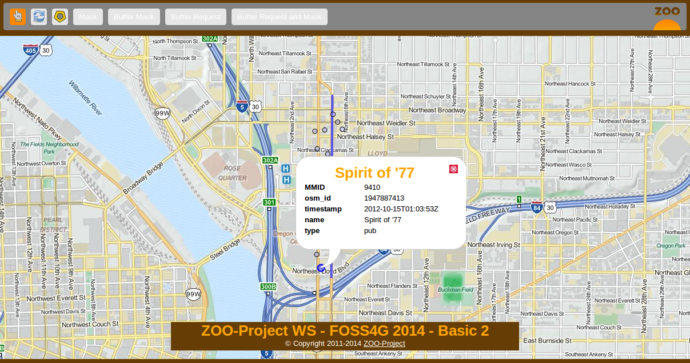
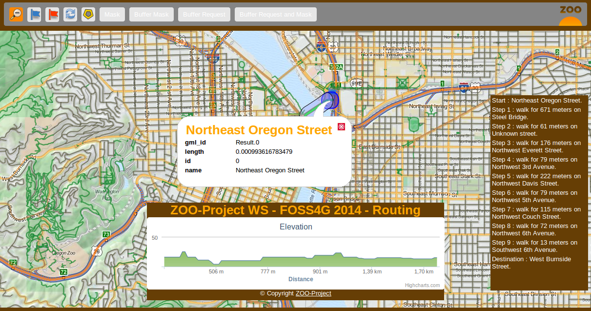

.. _ogr_base_vect_ops:

Playing with buildign blocks - Creating JavaScript Web Services
=============================================

.. contents:: Table of Contents
    :depth: 5
    :backlinks: top

Introduction
-------------------------------------------------

This section illustrate how you can use JavaScript on the server-side to chain 
services together to build new ones. You will create a ZOO Services Provider 
using the services you seen before and the WFS server using the ZOO-API. The 
final goal is to query all POIs included in a buffer around a feature and
to highlight them using a mask around this buffer. The following screenshot show
you the expected result:

For the routing interface result should look like this:

You can decompose the result above in two different ones: the mask around the 
buffer and the points included in the buffer. So you will create two different 
Services: one called ``BufferMask`` and another one called ``BufferRequest``.

But before implementing any JavaScript Service, you will get an overview of how
to use ZOO-API from your ZOO-Project installation in the next section.

As before, you first create a new directory to store files for your new Services 
Provider:

.. code-block:: guess
    
    mkdir -p ~/zoo-ws/jschains/cgi-env/

ZOO-API Overview
-------------------------------------------------

ZOO-API and ZOO-Kernel JavaScript support make you able to run services 
implemented in JavaScript on the server side. JavaScript is a popular programing
language but mostly used on the client side. Let say from a browser, but here it
is a bit different.

To support JavaScript language ZOO-Kernel use the 
`SpiderMonkey <https://developer.mozilla.org/en/SpiderMonkey>`__ API to create a
javascript runtime environment from which it will load your JS file then extract
the function corresponding to the service to run it using the prefilled
parameters. The JavaScript runtime environment created by the ZOO-Kernel 
depend on your setup. If you placed the ``ZOO-api.js`` and ``ZOO-proj4js.js`` in
the same directory as your ZOO-Kernel it means that your environment will 
contains ZOO-API and Proj4js which will be loaded before your service. In such case you can access to the Classes defined in the JavaScript ZOO-API 
to manipulate geographic data, for more informations please refer to the 
`ZOO-API Documentation <http://zoo-project.org/docs/api/index.html>`__. 

Even if it can be useful to run JavaScript on the server side, you should 
remember that some basic JavaScript functions you are familiar with does not 
exist or get a different behavior. For instance the simple ``alert`` 
function will display messages in apache error logs rather than in a window when
used from a browser. The ``alert`` function can be used as follow:

.. code-block:: guess

    alert("My alert message");

There is no XMLHttpRequest available in the JavaScript evironement your service 
will run into. Hopefully, the ZOO-Kernel expose a C function to the JavaScript 
world named: ``JSRequest``. This function make you able from your JavaScript 
services to call other WPS services (locally or remotelly) or other kind OGC 
services such as WFS. When you are using the ZOO-API it is possible to call 
Services using a ``ZOO.Process`` instance [#f3]_, to parse WPS Responses using 
``ZOO.Format.WPS`` 
(cf. `ref <http://zoo-project.org/docs/api/zoo-process.html>`__).

As for Python services you already seen in previous sections, the functions 
corresponding to a Service should take three arguments: ``conf``, ``inputs`` and
``outputs`` [#f4]_. Nevertheless, as the ZOO-Kernel is not able to access the 
values modified [#f5]_ by the Service code, rather than returning an integer as 
in Python, here you'll need to return both the integer value representing the 
Status of your Service in a JavaScript Object and the resulting ``outputs`` 
values as an Object [#f6]_. You can see in the following an example of a JavaScript 
Service code:

.. code-block:: none
    
    function SampleService(conf,inputs,outputs){
      var resultValue=someComputation(inputs);
      return
        {
            result: ZOO.SERVICE_SUCCEEDED, 
            outputs: { "Result": { "mimeType": "application/json", "value": resultValue } }
        };
    }

Before starting to implement the Services we will need to get our final 
BufferRequest service, let start with a simplier one.

The Mask Service
-------------------------------------------------

In this section you will learn how to create your first JavaScript service which
will simply return a rectangular mask around a selected feature. To build this 
mask you will use the Buffer service to create a buffer big enough around a 
selected geometry to cover a significant part of your map. You can see the 
expected result in the following screenshot:

As before, you will first start by writting the ZCFG, then you will write the 
JavaScript source code and finish by publishing your Services Provider.

The ZCFG
......................

Open a file named 
``~/zoo-ws/jschains/cgi-env/Mask.zcfg`` 
with your favorite text editor and add the following content:

.. code-block:: none
    :linenos:
    
    [Mask]
     Title = Compute mask
     Abstract = Compute mask around a geometry
     processVersion = 1
     storeSupported = true
     statusSupported = true
     serviceProvider = foss4gws.js
     serviceType = JS
     <DataInputs>
      [InputData]
       Title = The feature
       Abstract = The feature to run the service with
       minOccurs = 1
       maxOccurs = 1
       <ComplexData>
        <Default>
        mimeType = text/xml
        encoding = utf-8
        </Default>
       </ComplexData>
     </DataInputs>
     <DataOutputs>
      [Result]
       Title = The resulting feature
       Abstract = The feature created by the service.
       <ComplexOutput>
         <Default>
         mimeType = application/json
         </Default>
       </ComplexOutput>
     </DataOutputs>  

Here you simply define one default ``ComplexData`` for both ``inputData`` and
``Result``: a GML and a GeoJSON respectively [#f7]_.
 
The JavaScript service
...........................................

As you will have to request the Buffer service many times from your service, you
will first define a ``Buffer`` function as follow. It uses the ``ZOO.Process`` 
to request the Buffer service you seen in the previous section.

Open a file named 
``~/zoo-ws/jschains/cgi-env/foss4gws.js`` and 
add the following content:

.. code-block:: javascript
    :linenos:
    
    var zoo_url='http://localhost/cgi-bin/zoo_loader.cgi';
    var mapfile="/var/data/maps/project_WS2014.map";
    var mapserv_url="http://localhost/cgi-bin/mapserv?map="+mapfile;

    function Buffer(inputData,bDist){
    
      // Create all required ZOO.formats
      var fJ=new ZOO.Format.JSON();
      var fGJ=new ZOO.Format.GeoJSON();
      var fWPS=new ZOO.Format.WPS();
    
      // Pass the value as json
      var myInputs = {
      	  InputPolygon: { type: 'complex', value: fGJ.write(inputData), mimeType: "application/json"}, 
	  BufferDistance: {type: 'float', "value": bDist }
      };  
      var myOutputs= { Result: { type: 'RawDataOutput', "mimeType": "application/json" } };
      var myProcess = new ZOO.Process(zoo_url,'BufferPy');
      var myExecuteResult=myProcess.Execute(myInputs,myOutputs);
    
      return fGJ.read(myExecuteResult);
    
    }

From line 12 to 16, you give a GeoJSON string (created from ``inputData``) for 
InputPolygon and, on line 15, you set the BufferDistance value to ``bDist``. 
On line 17, you define Result as a RawDataOutput, so you won'tl have to parse the
WPS response using the ZOO.Format.WPS.

On line 18, you create a 
`ZOO.Process <http://zoo-project.org/docs/api/zoo-process.html#zoo-process>`__ 
instance providing the ZOO-Kernel url and the Service name. Then, on line 19, you
run the request passing inputs and outputs previously defined (from line 12 to 15). On line 21 you return the GeoJSON red.

Now, you get your ``Buffer`` function, it is time to create your first JavaScript 
service. So, edit your ``foss4gws.js`` file you created before and add the following content:

.. code-block:: javascript
    :linenos:
    
    function Mask(conf,inputs,outputs){
      
      // Create all required ZOO.formats
      var fGML=new ZOO.Format.GML();
      var fGJ=new ZOO.Format.GeoJSON();
    
      // Read the input GML
      var inputData=fGML.read(inputs["InputData"]["value"]);
      
      // Compute Buffer
      var bufferResultAsJSON=Buffer(inputData,0.015);
    
      // Create the Buffer result BBOX and store its geometry in a ZOO.Feature
      var bbox = new ZOO.Bounds();
      var bounds=bufferResultAsJSON[0].geometry.getVertices();
      for(var t in bounds){
        bbox.extend(bounds[t]);
      }
      var finalG=bbox.toGeometry();
      var result=new ZOO.Feature(finalG,{"name": "Result1000"});
      
      // Return the created feature
      return {
          result: ZOO.SERVICE_SUCCEEDED, 
          outputs: { "Result": { mimeType: "application/json", value: fGJ.write(result) } } 
      };
     
    }

Publish and use your Service
................................................................

Now you get both your ZCFG and your service code ready, you need to deploy your 
new Services Provider using the following command:

.. code-block:: bash
    
    sudo cp ~/zoo-ws/jschains/cgi-env/* /usr/lib/cgi-bin

Now you are ready to use your JavaScript service by loading the following `url 
<http://localhost/zoo-ws/spatialtools.html>`__, click on a street then click on
the "Mask" button.

BufferMask Service
-------------------------------------------------

In this section you will implement a simple JavaScript service which will be able create
a hole in the mask you created in `previous section <#mask-service>`__. This service
will be used to highlight the buffer zone around a selected fature. You get a preview of 
the expected result in the following screenshot:

The ZCFG
................................................................

Open the file named 
``~/zoo-ws/jschains/cgi-env/BufferMask.zcfg`` 
with your favorite text editor and copy / paste the following content:

.. code-block:: none
    :linenos:
    
    [BufferMask]
     Title = Compute buffer mask
     Abstract = Compute buffer mask around a geometry
     processVersion = 1
     storeSupported = true
     statusSupported = true
     serviceProvider = foss4gws.js
     serviceType = JS
     <DataInputs>
      [InputData]
       Title = The feature
       Abstract = The feature to run the service with
       minOccurs = 1
       maxOccurs = 1
       <ComplexData>
        <Default>
        mimeType = text/xml
        encoding = utf-8
        </Default>
       </ComplexData>
     </DataInputs>
     <DataOutputs>
      [Result]
       Title = The resulting feature
       Abstract = The feature created by the service.
       <ComplexOutput>
         <Default>
         mimeType = application/json
         </Default>
       </ComplexOutput>
     </DataOutputs>  

This ZCFG is similar to the previous one. Please, refer to comments in the 
`previous section <#the-zcfg>`__ for more informations.

The JavaScript service
................................................................

In this Service you will use same source code (until line 19) you used in the 
`previous section <#the-javascript-service>`__. Indeed, you should compute the Mask
as you did before then compute Buffer for creating a hole in the mask (on line 22) to run 
the Difference service (from line 25 to 40). 

.. code-block:: guess
    :linenos:
    
     function BufferMask(conf,inputs,outputs){
       
       // Create all required ZOO.formats
       var fGML=new ZOO.Format.GML();
       var fGJ=new ZOO.Format.GeoJSON();
     
       // Read the input GML
       var inputData=fGML.read(inputs["InputData"]["value"]);
       
       // Compute Buffer
       var bufferResultAsJSON=Buffer(inputData,0.015);
     
       // Create the Buffer result BBOX 
       var bbox = new ZOO.Bounds();
       var bounds=bufferResultAsJSON[0].geometry.getVertices();
       for(var t in bounds){
         bbox.extend(bounds[t]);
       }
       var finalG=bbox.toGeometry();

      // Compute Buffer standard buffer
      var bufferResultAsJSON=Buffer(inputData,0.0015);
    
      // Request Difference service using Buffer result and features in the BBOX
      var result=new ZOO.Feature(finalG,{"name": "Result1000"});  
      var myProcess2 = new ZOO.Process(zoo_url,'DifferencePy');
      var myInputs2 = {
          InputEntity1: {
              type: 'complex', 
              value: fGJ.write(finalG), 
              mimeType: "application/json" 
          }, 
          InputEntity2: { 
              type: 'complex', 
              value: fGJ.write(bufferResultAsJSON), 
              mimeType: "application/json"
          }
      };
      var myOutputs2= {Result: {type: 'RawDataOutput',  mimeType: "application/json" } };
      var myExecuteResult4=myProcess2.Execute(myInputs2,myOutputs2);

       // Return the bbox
       var result=new ZOO.Feature(finalG,{"name": "Result1000"});
       return {
           result: ZOO.SERVICE_SUCCEEDED, 
           outputs: { "Result": {mimeType: "application/json", value: myExecuteResult4 } } 
       };
     
     }

Publish and use your Service
................................................................

Now, you can publish your service as you did `before <#publish-your-service>`__. To 
use your service, please use the following `url 
<http://localhost/zoo-ws/spatialtools.html>`__.

BufferRequest service
----------------------------

In this section, you will create a new Service: ``BufferRequest`` which will request 
POIs included in the Buffer around a selected feature [#f8]_. You will use the ``poi`` 
layer served as WFS through your local mapserver installation. You can see in the 
following screenshot the expected result: 

The ZCFG
................................................................

Open the file named 
``~/zoo-ws/jschains/cgi-env/BufferRequest.zcfg`` 
with your favorite text editor and copy / paste the following content:

.. code-block:: none
    :linenos:
    
    [BufferRequest]
     Title = Compute buffer request
     Abstract = Compute buffer request around a geometry
     processVersion = 1
     storeSupported = true
     statusSupported = true
     serviceProvider = foss4gws.js
     serviceType = JS
     <DataInputs>
      [InputData]
       Title = The feature
       Abstract = The feature to run the service with
       minOccurs = 1
       maxOccurs = 1
       <ComplexData>
        <Default>
        mimeType = text/xml
        encoding = utf-8
        </Default>
       </ComplexData>
     </DataInputs>
     <DataOutputs>
      [Result]
       Title = The resulting feature
       Abstract = The feature created by the service.
       <ComplexOutput>
         <Default>
         mimeType = application/json
         </Default>
       </ComplexOutput>
     </DataOutputs>  

The JavaScript code
................................................................

As in the previous Service, you will compute a buffer around the input feature. But then
you will request POIs available in the Buffer extent using a WFS request to use them to 
run ``Intersection`` service using the initial Buffer. The WFS request is useful to limit 
the number of points to use when requesting the ``Intersection`` Service.

.. code-block:: javascript
    :linenos:
    
    function BufferRequest(conf,inputs,outputs){
    
      // Create all required ZOO.formats
      var fGJ=new ZOO.Format.GeoJSON();
      var fGML=new ZOO.Format.GML();
    
      // Read the input GML
      var inputData=fGML.read(inputs["InputData"]["value"]);
    
      // Compute Buffer
      var bufferResultAsJSON=Buffer(inputData,0.0015);
    
      // Create the Buffer result BBOX 
      var bbox = new ZOO.Bounds();
      var bounds=bufferResultAsJSON[0].geometry.getVertices();
      for(var t in bounds){
        bbox.extend(bounds[t]);
      }
    
      // Request Intersection service using Buffer result and WFS request using the
      // BBOX
      var myProcess2 = new ZOO.Process(zoo_url,'Intersection');
      var req="&amp;SERVICE=WFS&amp;version=1.0.0&amp;request=GetFeature&amp;typename=poi1";
      req+="&amp;SRS=EPSG:4326&amp;BBOX=";
      var myInputs2 = {
        InputEntity1: { 
          type: 'complex',  
          value: fGJ.write(bufferResultAsJSON), 
          mimeType: "application/json"
        }, 
        InputEntity2: { 
          type: 'complex',  
          xlink: mapserv_url+req+bbox.left+","+bbox.bottom+","+bbox.right+","+bbox.top, 
          mimeType: "text/xml" 
        } 
      };
      var myOutputs2= {Result: { type: 'RawDataOutput', "mimeType": "application/json" } };
      var myExecuteResult4=myProcess2.Execute(myInputs2,myOutputs2);
    
      return {
        result: ZOO.SERVICE_SUCCEEDED, 
        outputs: [ {name:"Result", mimeType: "application/json", value: myExecuteResult4} ]
      };
    
    }

.. warning:: to take advantage of the ZOO-Kernel cache system, you directly use the WFS
    request  as ``xlink:href`` rather than value for ``InputEntity2`` (from line 31 to 34) and use ``text/xml`` ``mimeType`` 
    (on line 40). Indeed, the ZOO-API doesn't use the internal cache mechanisms.

Publish and use your Service
................................................................

Now, you can publish your service as you did `before <#publish-your-service>`__. To 
use your service, please use the following `url 
<http://localhost/zoo-ws/spatialtools.html>`__.

.. note:: You can click on "Buffer Request and Mask"  to get the same result as presented 
    in  `the initial screenshot <#introduction>`__.

Add Union into the chain
----------------------------

As you can see in the following screenshot, when using the Buffer
service using a feature collection containing more than one geometry,
the result is made of multiple geometries. So, running Buffer service
on the routing interface will result in multiple buffer:

So, to get the same result as you got when selecting a single
road, you should use Union of geometry (input or the one outputed by the
``Buffer`` Service). As you are using the JavaScript ZOO-API, you can
simply update the ``Buffer`` JavaScript function you defined earlier, to
first call the Union of each geometry avaible in a feature collection
prior to request (or after requesting) the Buffer Service. Hopefully,
there is already this Python Service available, its name is
``UnionOne1``, so you just need to add it in your Service chain.

Here is the final code for the Buffer JavaScript function:

.. code-block:: javascript
    :linenos:
    
    function Buffer(inputData,bDist){
    
      // Create all required ZOO.formats
      var fJ=new ZOO.Format.JSON();
      var fGJ=new ZOO.Format.GeoJSON();
      var fWPS=new ZOO.Format.WPS();
    
      // Call the UnionOne1 Service
      var myInputs0 = {
      	  InputPolygon: { type: 'complex', value: fGJ.write(inputData), mimeType: "application/json"}, 
	  BufferDistance: {type: 'float', "value": bDist }
      };  
      var myOutputs0= { Result: { type: 'RawDataOutput', "mimeType": "application/json" } };
      var myProcess0 = new ZOO.Process(zoo_url,'UnionOne1');
      var myExecuteResult0=myProcess0.Execute(myInputs0,myOutputs0);

      // Call the BufferPy Service
      var myInputs = {
      	  InputPolygon: { type: 'complex', value: myExecuteResult0, mimeType: "application/json"}, 
	  BufferDistance: {type: 'float', "value": bDist }
      };  
      var myOutputs= { Result: { type: 'RawDataOutput', "mimeType": "application/json" } };
      var myProcess = new ZOO.Process(zoo_url,'BufferPy');
      var myExecuteResult=myProcess.Execute(myInputs,myOutputs);
    
      return fGJ.read(myExecuteResult);
    
    }

   
Conclusion
----------------------------

After understanding how basic Geometric Operation Services works, here you built step by step new JavaScript services which reuse the previous ones and combine them in different ways. This was achieved using the ZOO-API, composed by C functions exposed by the ZOO-Kernel to the JavaScript services runtime environement and the JS files which can be optionally installed. 

.. rubric:: Footnotes

.. [#f3] The ``ZOO.Process`` class uses ``JSRequest`` (cf. `ref 
    <http://zoo-project.org/docs/api/zoo-format-wps.html>`__). You will get example
    of use `later  <#the-javascript-service>`__.
.. [#f4] So ``conf``, ``inputs`` and ``outputs`` are simple JavaScript objects, similar 
    to the Python dictionaries used in the `previous section <ogr_base_vect_ops.html>`__.    
.. [#f5] Such as ``conf``, ``inputs`` and ``outputs``.
.. [#f6] You can also return a conf Object if you get any informations updated from your JavaScript service (such as cookie for instance)
.. [#f7] Using one of the available ``ZOO.formats`` you are also able to support various
    ``ComplexData`` for both input and output of the service. To simplify the 
    presentation here, you will use only this default ones.
.. [#f8] So in the hole you created in the previous section.
