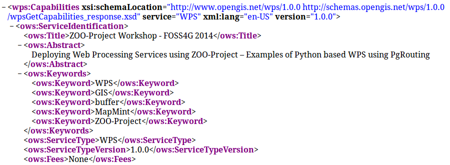
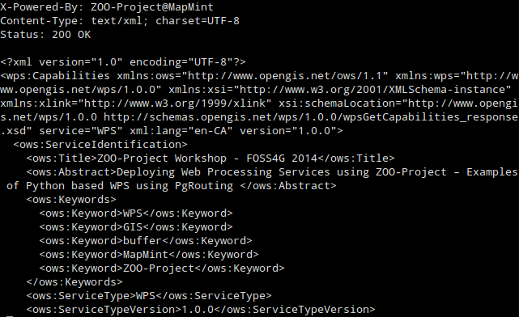

.. _using_zoo_from_osgeolivevm:

Configuration and ZOO-Kernel use
=====================================================

.. contents:: Table of Contents
    :depth: 5
    :backlinks: top

ZOO-Kernel Configuration
---------------------------------------------------

As already said in introduction, an OSGeoLive Virtual Machine has been booted on your computer, allowing you to use ZOO-Kernel in a development environment directly. 

.. note:: we will use ZOO-Kernel or ``zoo_loader.cgi`` script without any distinction 
    in this document.

General ZOO-Kernel settings are set in the ``main.cfg`` file located in the same directory as the ZOO-Kernel, so in ``/usr/lib/cgi-bin/``. This informations will be accessible from each services at runtime, so when you wil use Execute requests. You can see a typical ``main.cfg`` content in the following:

.. code-block:: guess
    :linenos:
    
    [headers]
    X-Powered-By=ZOO-Project@MapMint
    
    [main]
    encoding=utf-8
    dataPath=/var/data
    tmpPath=/var/www/temp
    cacheDir=/var/www/cache
    version=1.0.0
    sessPath=/tmp
    msOgcVersion=1.0.0
    serverAddress=http://localhost/cgi-bin/mm/zoo_loader.cgi
    lang=fr-FR,ja-JP
    language=en-US
    mapserverAddress=http://localhost/cgi-bin/mapserv.cgi
    tmpUrl=http://127.0.0.1/temp/
    
    [identification]
    keywords=WPS,GIS,buffer,MapMint,ZOO-Project
    title=ZOO-Project Workshop - FOSS4G 2014
    abstract= Deploying Web Processing Services using ZOO-Project – Examples of Python based WPS using PgRouting 
    accessConstraints=none
    fees=None
    
    [provider]
    positionName=Developer
    providerName=GeoLabs SARL
    addressAdministrativeArea=False
    addressDeliveryPoint=1280, avenue des Platanes
    addressCountry=fr
    phoneVoice=+33467430995
    addressPostalCode=34970
    role=Dev
    providerSite=http://www.geolabs.fr
    phoneFacsimile=False
    addressElectronicMailAddress=gerald@geolabs.fr
    addressCity=Lattes
    individualName=Gérald FENOY
    

The ``main.cfg`` file contains metadata informations about the identification and provider but also some important settings. The file is composed of various sections, namely ``[main]``, ``[identification]`` and ``[provider]`` per default. 

From the ``[main]`` section settings are as follow:
 * ``lang``: the supported languages separated by a coma (the first is the default one),
 * ``version``: the supported WPS version,
 * ``encoding``: the default encoding of WPS Responses,
 * ``serverAddress``: the url to access your ZOO-Kernel instance,
 * ``dataPath``: the path to store data files (when MapServer support was activated, 
   this directory is used to store mapfiles and data).
 * ``tmpPath``: the path to store temporary files (such as ExecuteResponse when 
   storeExecuteResponse was set to true),
 * ``tmpUrl``: a url relative to ``serverAddress`` to access the temporary file,
 * ``cacheDir``: the path to store cached request files [#f1]_ (optional),
 * ``mapservAddress``: your local MapServer address (optional),
 * ``msOgcVersion``: the version for all supported OGC Web Services output [#f2]_
   (optional).

The ``[identification]`` and ``[provider]`` section are specific to OGC metadata and
should be set [#f3]_.

Obviously, you are free to add new sections to this file if you need
more [#f8]_. Nevertheless, you have to know 
that there is some specific names you should use only for specific
purposes: ``[headers]``, ``[mapserver]``, ``[env]``, ``[lenv]`` and ``[senv]``.

.. warning:: ``[senv]`` and ``[lenv]`` are used / produced on runtime internaly by the ZOO-Kernel and should be defined only from the Service code.

The ``headers`` section is used to define your own HTTP Response
headers. You may take a look at headers returned by web site such as 
http://www.zoo-project.org by using curl command line tool for
instance and notice the specific heder ``X-Powered-By: Zoo-Project@Trac``.

.. warning:: There is no reason to define basic headers such as
    ``Content-Type`` or ``encoding`` as they will be overwritten at runtime by the
    ZOO-Kernel.

The ``mapserver`` section is used to store specific mapserver configuration 
parameters such as `PROJ_LIB` and `GDAL_DATA` or any other you want to be set to 
make your MapServer working.

.. note:: the ``mapserver`` section is mainly used on WIN32 platform

The ``env`` section is used to store specific environment variables you want to be set 
prior to load your Services Provider and run your Service. A typical example, is when your
Service requires to access to a X server running on framebuffer, then you will have to 
set the ``DISPLAY`` environnement variable, in this case you would add 
``DISPLAY=:1`` line in your ``[env]`` section.

The ``lenv`` is used to store runtime informations automatically set by the 
ZOO-Kernel before running your service and can be accesses / updated from it:
 * ``sid`` (r): the service unique identifier, 
 * ``status`` (rw): the current progress value (value between 0 and 100, percent),
 * ``cwd`` (r): the current working directory of the ZOO-Kernel,
 * ``message`` (rw): an error message when returning ``SERVICE_FAILED`` (optional),
 * ``cookie`` (rw): the cookie your service want to return to the client (for authentication
   purpose or tracking).

The ``senv`` is used to store session informations on the server
side. You can then access them automatically from service if the
server is requested using a valid cookie (as defined in ``lenv >
cookie``). The ZOO-Kernel will store on disk the values set in the
``senv`` maps, then load it and dynamically add its content to the one
available in the ``main.cfg``. The ``senv`` section should contain at
least:
 * ``XXX``: the session unique identifier where ``XXX`` is the name included in the 
    returned cookie.

.. _cookie_example:

For instance, if you get the following in your Service source code [#f4]_ :

.. code-block:: python
    
    conf["lenv"]["cookie"]="XXX=XXX1000000; path=/" 
    conf["senv"]={"XXX": "XXX1000000","login": "demoUser"}

That means that the ZOO-Kernel will create a file ``sess_XXX1000000.cfg`` in the 
``cacheDir`` and return the specified cookie to the client. Each time the client will 
request the ZOO-Kernel using the Cookie, it will automatically load the value stored 
before running your service. You can then easilly access this informations from your 
service source code. This functionality won't be used in the following presentation.

Testing the ZOO installation with GetCapabilities
---------------------------------------------------

Once you have a main.cfg file available in the same directory as your
ZOO-Kernel, then you can use `GetCapablities`. Indeed, to answer such
kind of requests, the ZOO-Kernel will simply parse the `main.cfg` file
(to gather global informations), then parse individually each zcfg
files (if any) contained in the same directory or in sub-directories
[#f9]_, then return a well formed `Capabilities` document.

You can request ZOO-Kernel using the following link from your Internet browser: 

http://localhost/cgi-bin/zoo_loader.cgi?Request=GetCapabilities&Service=WPS

You should get a valid Capabilities XML document, looking like the following :

Please note that some Process nodes are returned in the
ProcessOfferings section, as somes are available already on OSGeoLive
DVD. You can also run a GetCapabilities request from the command line,
using the following command:  

.. code-block:: bash

    cd /usr/lib/cgi-bin
    ./zoo_loader.cgi “request=GetCapabilities&service=WPS” | less

The same result as in your browser will be returned, as shown in the following screenshot: 

Invoking ZOO Kernel from the command line can be helpful during 
development process of new Services for debugging purpose. If you
need to simulate POST request from the command line, then you can use
the following: 

.. code-block:: bash

    cd /usr/lib/cgi-bin
    # Download the sample GetCapabilities request
    curl -o /tmp/10_wpsGetCapabilities_request.xml http://schemas.opengis.net/wps/1.0.0/examples/10_wpsGetCapabilities_request.xml
    # Define required environment settings
    export REQUEST_METHOD=POST
    export CONTENT_TYPE=text/xml
    # Run the request downloaded
    ./zoo_loader.cgi < /tmp/10_wpsGetCapabilities_request.xml | less

You should have the same result as presented before.

.. rubric:: Footnotes

.. [#f1] when you use GET requests passed through ``xlink:href`` the ZOO-Kernel will
    execute the request only once, the first time you will ask for this ressource and it will
    store on disk the result. The next time you will need the same feature, the cached file
    will be used which make your process running faster. If ``cachedir`` was not 
    specified in the ``main.cfg`` then ``tmpPath`` value will be used.
.. [#f2] since version 1.3.0, when MapServer is activated, your service can automatically 
    return a WMS, WFS or WCS request to expose your data. Your can set here the specific
    version number you want to use to request your local MapServer setup. It depends 
    mostly on the client capability to deal with specific OGC Web Services version.
.. [#f3] since version 1.3.0, when MapServer is activated, the same metadata will be used
    for setting metadata for OGC Web Services.
.. [#f8] you can take a quick look into the mapmint ``main.cfg`` file
    which is available in `/usr/lib/cgi-bin/mm/` directory to have
    example of sections use.
.. [#f4] If you're not familiar with ZOO-Project, you can `pass <using_zoo_from_osgeolivevm#testing-the-zoo-installation-with-getcapabilities>`__  this part and come to it after the next section.
.. [#f9] sub-directories listing is available from `revision 469 <http://zoo-project.org/trac/changeset/469>`__.
