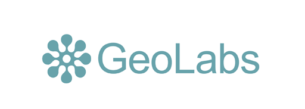
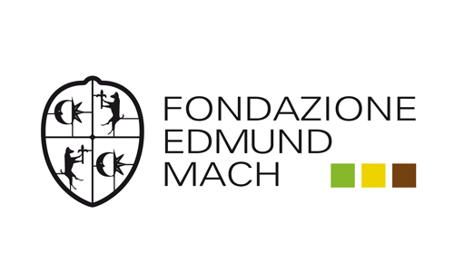
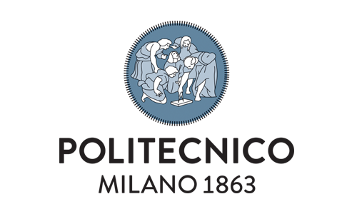
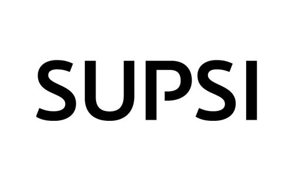

.. _contents:

ZOO-Project workshop 
=============================

Welcome on the `ZOO-Project <http://zoo-project.org>`__ workshop
section, here you can find hands on materials presenting how to use
the ZOO-Project for the first time in an `OSGeoLive
<http://live.osgeo.org/>`__ environment.

.. toctree::
   :maxdepth: 1

   2015/index
   2014/index
   2013/index
   2012/index
   2010/index

This document is released under the Creative Commons
Attribution-ShareAlike 4.0 International Public License (`CC-BY-SA
<https://creativecommons.org/licenses/by-sa/4.0/legalcode>`__).

.. image:: _static/by-sa.png
   :height: 50px
   :width: 100px
   :alt: CC-BY-SA license

**Sponsored By**

.. image:: ./_static/apptech-logo.png
   :width: 156px
   :height: 56px
   :target: http://www.apptec.co.jp/   

.. image:: ./_static/neogeo-logo.png
   :width: 156px
   :height: 56px 
   :target: http://www-neogeo-online.net/  

**Special Thanks To Our Knowledge Partners**

.. image:: ./_static/ocu-logo.png
   :width: 156px
   :height: 94px
   :target: http://www.osaka-cu.ac.jp/english/

